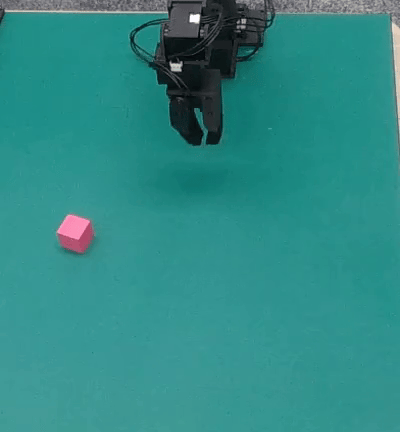
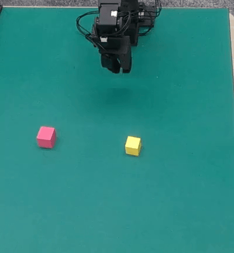

# RealRobot

Open-source implementations on real robots. This repository is currently under active development.

This repository also contains the real-world implementation of the following paper:

- **SPA: 3D Spatial-Awareness Enables Effective Embodied Representation**

    Haoyi Zhu, Honghui Yang, Yating Wang, Jiange Yang, Limin Wang, Tong He

    arXiv preprint, 2024

    [ [Project Page](https://haoyizhu.github.io/spa/) ] | [ [arXiv](https://arxiv.org/abs/2410.08208) ] | [ [Github](https://github.com/HaoyiZhu/SPA) ]

- **Point Cloud Matters: Rethinking the Impact of Different Observation Spaces on Robot Learning**
    
    Haoyi Zhu, Yating Wang, Di Huang, Weicai Ye, Wanli Ouyang, Tong He

    Neural Information Processing Systems (**NeurIPS**) Dataset & Benchmark, 2024

    [ [Project Page](https://haoyizhu.github.io/pcm/) ] | [ [arXiv](https://arxiv.org/abs/2402.02500) ] | [ [GitHub](https://github.com/HaoyiZhu/PointCloudMatters) ] | [ [Videos](https://drive.google.com/drive/folders/1UiFgHv9QUPEM2is-N10IJ47DjeYiiFEm?usp=drive_link) ]


## :clipboard: Contents

- [Demos](#tv-demos)
- [Installation](#hammer-installation)
- [Quick Start](#sunglasses-quick-start)
- [TODO](#date-todo)
- [License](#books-license)
- [Acknowledgement](#sparkles-acknowledgement)
- [Citation](#pencil-citation)

## :tv: Demos

### Low Cost Robot

The videos are all done automatically by learned policies.

| Pick Cube | Stack Cube | Fold Cloth |
| --------- | ---------- | ----------- |
|  |  |  |


## :hammer: Installation

<details>
<summary><b>Basics</b></summary>

```bash
conda create -n realrobot python=3.11 -y
pip install -r requirements.txt
```

</details>

<details>
<summary><b> Point cloud related</b></summary>

```bash
# please install with your PyTorch and CUDA version
# e.g. torch 2.4.0 + cuda 118:
pip install torch-geometric  torch-scatter torch-sparse torch-cluster -f https://data.pyg.org/whl/torch-2.4.0+cu118
```

> **Note**: `spconv` must matches your CUDA version, see [official Github](https://github.com/traveller59/spconv) for more information.
```bash
# e.g. for CUDA 11.8:
pip3 install spconv-cu118
```

```bash
# build FPS sampling operations (CUDA required)
cd libs/pointops
# docker & multi GPU arch
TORCH_CUDA_ARCH_LIST="ARCH LIST" python setup.py install
# e.g. 7.5: RTX 3000; 8.0: a100 More available in: https://developer.nvidia.com/cuda-gpus
TORCH_CUDA_ARCH_LIST="7.5 8.0" python setup.py install
cd ../..
```

</details>

<details>
<summary><b> Cameras </b></summary>

1. RealSense

    - Install [librealsense](https://github.com/IntelRealSense/librealsense/blob/development/doc/installation.md)

        Repeat here:
        ```bash
        sudo apt-get update && sudo apt-get upgrade && sudo apt-get dist-upgrade
        sudo apt-get install libssl-dev libusb-1.0-0-dev libudev-dev pkg-config libgtk-3-dev
        sudo apt-get install git wget cmake build-essential
        sudo apt-get install libglfw3-dev libgl1-mesa-dev libglu1-mesa-dev at

        cd /some/path
        git clone https://github.com/IntelRealSense/librealsense.git
        cd IntelRealSense
        ./scripts/setup_udev_rules.sh
        ./scripts/patch-realsense-ubuntu-lts-hwe.sh

        mkdir build && cd build

        cmake ../ -DCMAKE_BUILD_TYPE=Release
        sudo make uninstall && make clean && make && sudo make install
        ```

        After installing, you can connect cameras with USB and you can run `realsense-viewer` to get the serial numbers as well as to visualize results.

    - Install [pyrealsense2](https://github.com/IntelRealSense/librealsense/tree/master/wrappers/python)

        ```bash
        pip install pyrealsense2
        ```
    
    - Open `realsense-viewer` and get the serial numbers of your cameras. Modify the variables [here](configs/camera/realsense.yaml). We use two cameras by default, but it is very easy to adapt to other number of cameras.

</details>

<details>
<summary><b> Robots </b></summary>

1. Low-Cost-Robot

    Please follow the [original repo](https://github.com/AlexanderKoch-Koch/low_cost_robot).

</details>

## :sunglasses: Quick Start

<details>
<summary><b> Camera Caliberation </b></summary>

To caliberate your camera, you can first print out the charuco file under [asserts/calib.io_charuco_297x210_5x7_35_26_DICT_4X4.pdf](asserts/calib.io_charuco_297x210_5x7_35_26_DICT_4X4.pdf) and put it on your table. Then you can run with:

```bash
python scripts/caliberate_cameras.py
```

The caliberation file will be saved under `data/calib`.

</details>

<details>
<summary><b> Tele-operation </b></summary>

- For single arm setting, you can run with:

```bash
python scripts/record_low_cost_robot_teleop.py task_name=${task_name} user_name=${use_name} episode_id=${episode_id} teleop=low_cost_robot_single_arm teleop.leader.device_name=${device_name} teleop.follower.device_name=${device_name}
```

- Similarly, for dual arm setting, you can run with:

```bash
python scripts/record_low_cost_robot_teleop.py task_name=${task_name} user_name=${use_name} episode_id=${episode_id} teleop=low_cost_robot teleop.op_left.leader.device_name=${device_name} teleop.op_left.follower.device_name=${device_name} teleop.op_right.leader.device_name=${device_name} teleop.op_right.follower.device_name=${device_name}
```

After each episode, you can press `q` to end it.

Then the reajectories will be saved under `data/teleop/${task_name}/${use_name}/ep_${episode_id}` with format of:

```
├── teleop
│   ├── ...
│   ├── task_name
│   │   ├── use_name
│   │   │   ├── ep_id
|   |   |   │   ├── meta.json   # meta data
|   |   |   │   ├── ${timestamp1}.npy    # recorded data
|   |   |   │   ├── ${timestamp2}.npy
|   |   |   │   ├── ...
│   └── ...
```

</details>

<details>
<summary><b> Training Examples </b></summary>

ACT training with RGB images, by default we use 4 gpu with DDP
```bash
python src/train.py task_name=${task_name} trainer.devices=4 exp_low_cost_robot=base_rgb task_name=reach_cube
```

RGB-D reach
```bash
python src/train.py task_name=reach_cube exp_low_cost_robot=base_rgbd
```

Pointcloud reach:
```bash
python src/train.py task_name=reach_cube exp_low_cost_robot=base_pcd data.train.calib_file=data/calib/reach.npy
```

Pick, train for more epochs:
```bash
# we use loop to control epoch length, as too much validation may be slow
# you can also use trainer.max_epochs to control epoch number
python src/train.py exp_low_cost_robot=base_rgb data.train.loop=500 exp_name=base_rgb_loop500 task_name=pick_cube
```

</details>

<details>
<summary><b> Evaluation Examples </b></summary>

Evaluate reach cube with RGB:
```bash
python src/eval_low_cost_robot_act.py exp_low_cost_robot=base_rgb task_name=reach_cube max_timesteps=150 num_rollouts=20 ckpt_path=${ckpt_path} num_rollouts=${num_rollouts}
```

Evaluate reach cube with point cloud:
```bash
python src/eval_low_cost_robot_act.py task_name=reach_cube max_timesteps=150 num_rollouts=20 exp_low_cost_robot=base_pcd data.train.calib_file=data/calib/reach.npy ckpt_path=${ckpt_path} num_rollouts=${num_rollouts}
```

The script will evaluate the given checkpoint with `${num_rollouts}` repeats. You can early stop one episode by press `Ctrl + C`.

</details>


## :date: TODO
- [x] Add RealSense RGB-D cameras
- [x] Add data collector 
- [x] Add low-cost-robot
    - [x] Teleoperation
    - [x] Inference
- [ ] Add More Robots (Coming soon, stay tuned!)
- [ ] Add policies
    - [x] ACT
    - [ ] Diffusion Policy

## :tada: Gotchas

<details>
<summary><b> Override any config parameter from command line </b></summary>

This codebase is based on [Hydra](https://github.com/facebookresearch/hydra), which allows for convenient configuration overriding:
```bash
python src/train.py trainer.max_epochs=20 seed=300
```
> **Note**: You can also add new parameters with `+` sign.
```bash
python src/train.py +some_new_param=some_new_value
```

</details>

<details>
<summary><b>Train on CPU, GPU, multi-GPU and TPU</b></summary>

```bash
# train on CPU
python src/train.py trainer=cpu

# train on 1 GPU
python src/train.py trainer=gpu

# train on TPU
python src/train.py +trainer.tpu_cores=8

# train with DDP (Distributed Data Parallel) (4 GPUs)
python src/train.py trainer=ddp trainer.devices=4

# train with DDP (Distributed Data Parallel) (8 GPUs, 2 nodes)
python src/train.py trainer=ddp trainer.devices=4 trainer.num_nodes=2

# simulate DDP on CPU processes
python src/train.py trainer=ddp_sim trainer.devices=2

# accelerate training on mac
python src/train.py trainer=mps
```

</details>

<details>
<summary><b>Train with mixed precision</b></summary>

```bash
# train with pytorch native automatic mixed precision (AMP)
python src/train.py trainer=gpu +trainer.precision=16
```

</details>

<details>
<summary><b>Use different tricks available in Pytorch Lightning</b></summary>

```yaml
# gradient clipping may be enabled to avoid exploding gradients
python src/train.py trainer.gradient_clip_val=0.5

# run validation loop 4 times during a training epoch
python src/train.py +trainer.val_check_interval=0.25

# accumulate gradients
python src/train.py trainer.accumulate_grad_batches=10

# terminate training after 12 hours
python src/train.py +trainer.max_time="00:12:00:00"
```

> **Note**: PyTorch Lightning provides about [40+ useful trainer flags](https://pytorch-lightning.readthedocs.io/en/latest/common/trainer.html#trainer-flags).

</details>

<details>
<summary><b>Easily debug</b></summary>

```bash
# runs 1 epoch in default debugging mode
# changes logging directory to `logs/debugs/...`
# sets level of all command line loggers to 'DEBUG'
# enforces debug-friendly configuration
python src/train.py debug=default

# run 1 train, val and test loop, using only 1 batch
python src/train.py debug=fdr

# print execution time profiling
python src/train.py debug=profiler

# try overfitting to 1 batch
python src/train.py debug=overfit

# raise exception if there are any numerical anomalies in tensors, like NaN or +/-inf
python src/train.py +trainer.detect_anomaly=true

# use only 20% of the data
python src/train.py +trainer.limit_train_batches=0.2 \
+trainer.limit_val_batches=0.2 +trainer.limit_test_batches=0.2
```

> **Note**: Visit [configs/debug/](configs/debug/) for different debugging configs.

</details>

<details>
<summary><b>Resume training from checkpoint</b></summary>

```yaml
python src/train.py ckpt_path="/path/to/ckpt/name.ckpt"
```

> **Note**: Checkpoint can be either path or URL.

> **Note**: Currently loading ckpt doesn't resume logger experiment, but it will be supported in future Lightning release.

</details>

<details>
<summary><b>Create a sweep over hyperparameters</b></summary>

```bash
# this will run 9 experiments one after the other,
# each with different combination of seed and learning rate
python src/train.py -m seed=100,200,300 model.optimizer.lr=0.0001,0.00005,0.00001
```

> **Note**: Hydra composes configs lazily at job launch time. If you change code or configs after launching a job/sweep, the final composed configs might be impacted.

</details>

<details>
<summary><b>Execute all experiments from folder</b></summary>

```bash
python src/train.py -m 'exp_maniskill2_act_policy/maniskill2_task@maniskill2_task=glob(*)'
```

> **Note**: Hydra provides special syntax for controlling behavior of multiruns. Learn more [here](https://hydra.cc/docs/next/tutorials/basic/running_your_app/multi-run). The command above executes all task experiments from [configs/exp_maniskill2_act_policy/maniskill2_task](configs/experiment/).

</details>

<details>
<summary><b>Execute run for multiple different seeds</b></summary>

```bash
python src/train.py -m seed=100,200,300 trainer.deterministic=True
```

> **Note**: `trainer.deterministic=True` makes pytorch more deterministic but impacts the performance.

</details>

For more instructions, refer to the official documentation for [Pytorch Lightning](https://github.com/Lightning-AI/pytorch-lightning), [Hydra](https://github.com/facebookresearch/hydra), and [Lightning Hydra Template](https://github.com/ashleve/lightning-hydra-template).


## :books: License

This repository is released under the [MIT license](LICENSE).

## :sparkles: Acknowledgement

Our code is primarily built upon [Pytorch Lightning](https://github.com/Lightning-AI/pytorch-lightning), [Hydra](https://github.com/facebookresearch/hydra), [Lightning Hydra Template](https://github.com/ashleve/lightning-hydra-template), [Point Cloud Matters](https://github.com/HaoyiZhu/PointCloudMatters), [EasyRobot](https://github.com/Galaxies99/easyrobot), [RH20T](https://github.com/rh20t/rh20t_api), [AirExo](https://github.com/AirExo/collector), [ACT](https://github.com/tonyzhaozh/act), [Shaka-Lab's implementation](https://github.com/Shaka-Labs/low_cost_robot), [Diffusion Policy](https://github.com/real-stanford/diffusion_policy). We extend our gratitude to all these authors for their generously open-sourced code and their significant contributions to the community.

## :pencil: Citation

```bib

@misc{realrobot2024,
    title={RealRobot: A Project for Open-Sourced Robot Learning Research},
    author={RealRobot Contributors},
    howpublished = {\url{https://github.com/HaoyiZhu/RealRobot}},
    year={2024}
}


@article{zhu2024point,
  title={Point Cloud Matters: Rethinking the Impact of Different Observation Spaces on Robot Learning},
  author={Zhu, Haoyi and Wang, Yating and Huang, Di and Ye, Weicai and Ouyang, Wanli and He, Tong},
  journal={arXiv preprint arXiv:2402.02500},
  year={2024}
}
```

